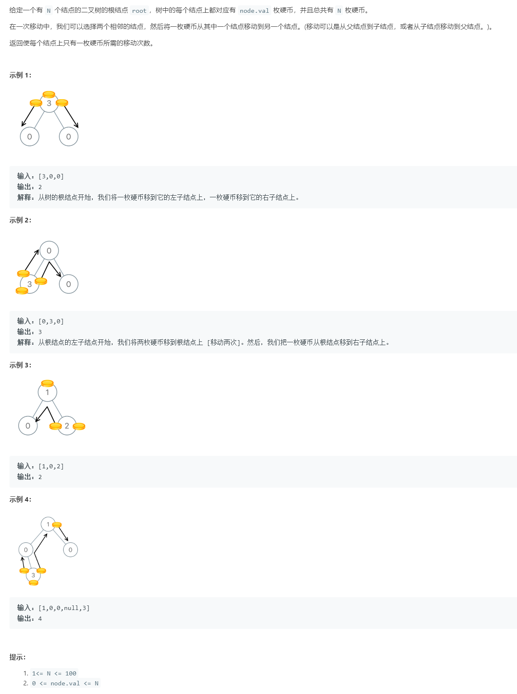

# 979. 在二叉树中分配硬币

[RevisionWorthy]



## Thinking:

方法：深度优先搜索
思路

如果树的叶子仅包含 0 枚金币（与它所需相比，它的 `过载量` 为 -1），那么我们需要从它的父亲节点移动一枚金币到这个叶子节点上。如果说，一个叶子节点包含 4 枚金币（它的 `过载量` 为 3），那么我们需要将这个叶子节点中的 3 枚金币移动到别的地方去。总的来说，对于一个叶子节点，需要移动到它中或需要从它移动到它的父亲中的金币数量为 `过载量 = Math.abs(num_coins - 1)`。然后，在接下来的计算中，我们就再也不需要考虑这些已经考虑过的叶子节点了。

## 算法

我们可以用上述的方法来逐步构建我们的最终答案。定义 `dfs(node)` 为这个节点所在的子树中金币的 `过载量`，也就是这个子树中金币的数量减去这个子树中节点的数量。接着，我们可以计算出这个节点与它的子节点之间需要移动金币的数量为 `abs(dfs(node.left)) + abs(dfs(node.right))`，这个节点金币的过载量为 `node.val + dfs(node.left) + dfs(node.right) - 1`。


## Solution:

The value of `getOverloadValueFor(root)` is always 0, because you don't need extra coins for the whole tree, it's the assumption of the problem. 

Calculating that is not the point of the answer, we need to `totalCnt`.

Calculating the `overload value` from bottom to root, accumulate the value for each sub tree.

Submission 1:

```java
/**
 * Definition for a binary tree node.
 * public class TreeNode {
 *     int val;
 *     TreeNode left;
 *     TreeNode right;
 *     TreeNode(int x) { val = x; }
 * }
 */
class Solution {
    public int totalCnt = 0;

    public int distributeCoins(TreeNode root) {
        getOverloadValueFor(root);
        return totalCnt / 2;
    }

    public int getOverloadValueFor(TreeNode node){
        if(node == null) return 0;

        int leftCnt = getOverloadValueFor(node.left);

        int rightCnt = getOverloadValueFor(node.right);

        int cnt = node.val + leftCnt + rightCnt - 1;
        
        totalCnt += Math.abs(cnt) + Math.abs(leftCnt) + Math.abs(rightCnt);

        return cnt; 
    }
}
```

Submission 2:

```java
/**
 * Definition for a binary tree node.
 * public class TreeNode {
 *     int val;
 *     TreeNode left;
 *     TreeNode right;
 *     TreeNode(int x) { val = x; }
 * }
 */
class Solution {
    public int totalCnt = 0;

    public int distributeCoins(TreeNode root) {
        getOverloadValueFor(root);
        // changed here
        return totalCnt;
    }

    public int getOverloadValueFor(TreeNode node){
        if(node == null) return 0;

        int leftCnt = getOverloadValueFor(node.left);

        int rightCnt = getOverloadValueFor(node.right);

        // changed here
        totalCnt += Math.abs(leftCnt) + Math.abs(rightCnt);

        return node.val + leftCnt + rightCnt - 1; 
    }
}
```