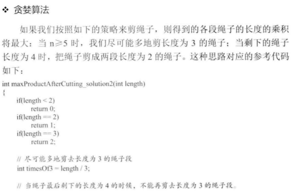
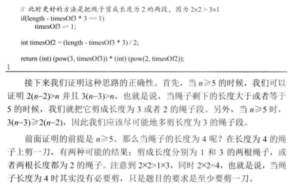

面试题14- I. 剪绳子

[RevisionWorthy]

[面试题14- I. 剪绳子](https://leetcode-cn.com/problems/jian-sheng-zi-lcof/)

给你一根长度为 n 的绳子，请把绳子剪成整数长度的 m 段（m、n都是整数，n>1并且m>1），每段绳子的长度记为 k[0],k[1]...k[m] 。请问 k[0]*k[1]*...*k[m] 可能的最大乘积是多少？例如，当绳子的长度是8时，我们把它剪成长度分别为2、3、3的三段，此时得到的最大乘积是18。

示例 1：

```
输入: 2
输出: 1
解释: 2 = 1 + 1, 1 × 1 = 1
```
示例 2:

```
输入: 10
输出: 36
解释: 10 = 3 + 3 + 4, 3 × 3 × 4 = 36
```
提示：

```
2 <= n <= 58
```


## Thinking

Typical DP, but the problem is the transition function:

`DP(n)` means the largest number for number `n` with one or more cut. 

## Solution

draft: simple dp to verify the idea

```java
class Solution {
    public int cuttingRope(int n) {
        return dp(n);
    }

    public int dp(int n){
        if(n <= 2) {
            return 1;
        }

        int max = 0;
        for(int i = 1; i <= n/2; i ++){
            // cut once
            int res = i * (n - i);
            // 
            int dpRes = i * dp(n - i);
            res = res < dpRes ? dpRes : res;
            max = max < res? res : max;
        }
        return max;
    }
}
```
Can't bother to submit it, since it's going to timeout.


```java
class Solution {
    public int[] array;

    public int cuttingRope(int n) {
        array = new int[n + 1];

        for(int length = 1; length <= n; length ++){
            if(length <= 2) {
                array[length] = 1;
            }

            int max = 0;
            // to length/2 is enough
            for(int i = 1; i <= length/2; i ++){
                // the result if it's been cut once
                int res = i * (length - i);
                // the result if it's cut more than once
                int dpres = i * array[length - i];
                res = res < dpres ? dpres : res;
                max = max < res? res : max;
            }
            array[length] = max;
        }
        return array[n];
    }
}
```

There is even a O(1) solution!!!
- Basically cut as many 3s as possible,
- When there is a 1 left, then put the 1 with the last 3 and cut in two 2s
  - 
  - 

## Pitfalls

The reason why it's 
```java
                // the result if it's been cut once
                int res = i * (length - i);
                // the result if it's cut more than once
                int dpres = i * array[length - i];
```
and not 

```java
                int dpres = array[i] * array[length - i];
```

is because you have to cut once. The latter means it's been cut three times! 